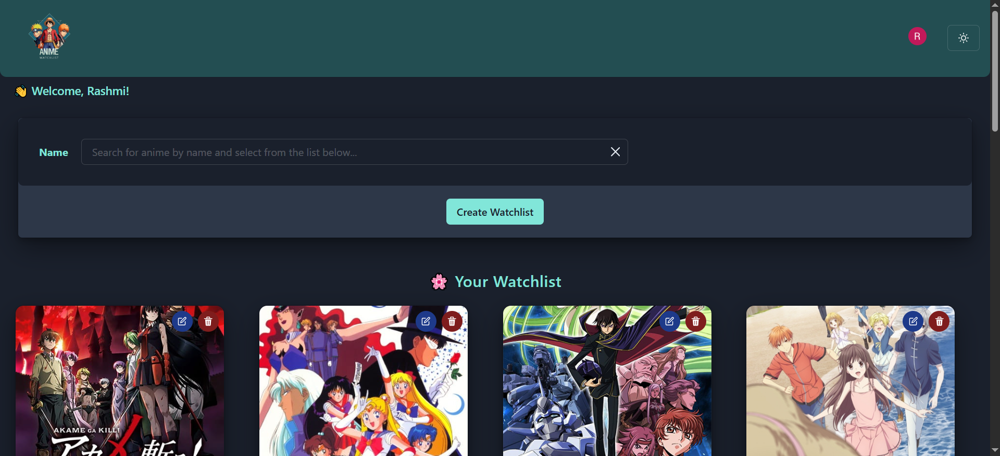
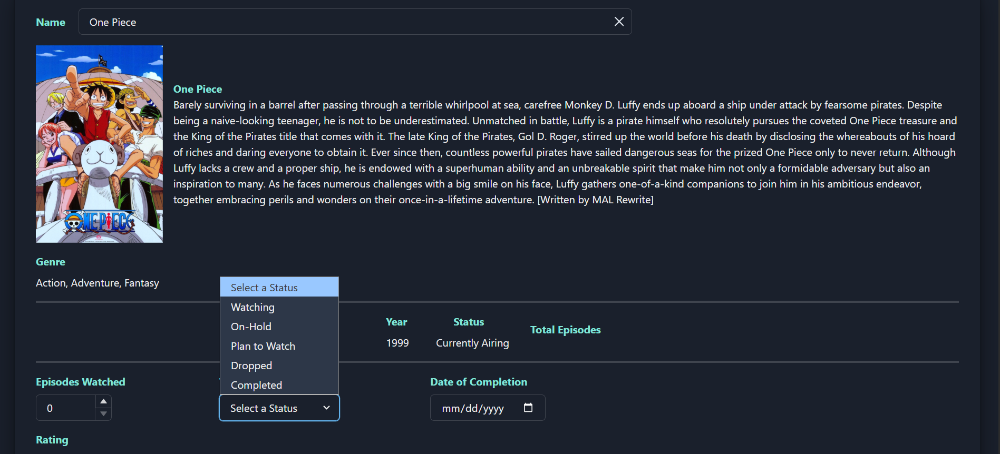
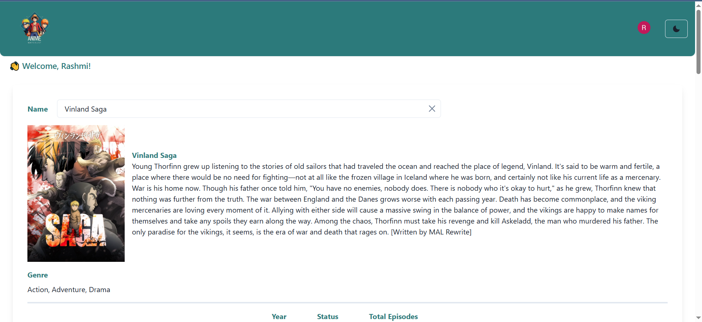

# Personalized Anime Watchlist


A sleek and responsive anime watchlist app built with **React**, **TypeScript**, and **Chakra UI**, designed for anime lovers who want to track their anime-watching journey with style.

---





---

## ✨ Features

- 📺 Add, edit, and delete anime entries with notes, genre tags, ratings, and watch status  
- 🎨 Fully responsive, anime-inspired UI with dark/light mode toggle  
- 🔐 User authentication with Clerk  
- ☁️ Persistent data storage with a RESTful backend  
- 🔁 Live CRUD operations and real-time refresh  
- 🌍 Deployed on Render

---

## 🔧 Tech Stack

- **Frontend**: React, TypeScript, Chakra UI, React Router DOM, Clerk  
- **Backend**: Express.js, MongoDB
- **Hosting**: Render (frontend + backend)  
- **Others**: Axios, Toastify, Chakra Icons

---

## 🚀 Live Demo

🔗 [Try it live here](https://personal-anime-watchlist-frontend.onrender.com)

---

## 📦 Getting Started

### Prerequisites
- Node.js v18+
- npm or yarn

### Installation

```bash
git clone https://github.com/5Rashmi/Personal-Anime-Watchlist.git
cd personal-anime-watchlist
npm install
```

### Running Locally

```bash
npm run dev
```

### Setup your .env file with

```env
VITE_CLERK_PUBLISHABLE_KEY=your_clerk_key
MONGO_URI=your_mongodb_uri
PORT=your_port_no
```

💬 **Have any questions, suggestions, or just want to chat?**  
Feel free to open an issue or reach out—I'd love to hear from you!

---

## License

This project is licensed under the MIT License. See the [LICENSE](LICENSE) file for details.

### 
